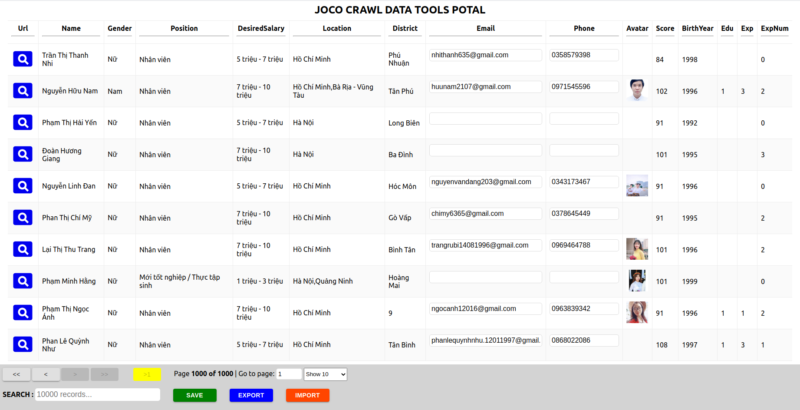

# VN HUMAN RESOURCES CRAWLER TOOL

## Table of content
- [About](#About)
    - [Introduction](#Introduction)
    - [Built with](#Built-with)
    - [Architecture](#Architecture)
    - [File Structure](#File-Structure)
- [Getting Started](#Getting-Started)
    - [Prerequisites](#Prerequisites)
    - [Installation](#Installation)
    - [Useful scripts](#Useful-scripts)
- [APIs Document](#APIs-Document)
- [Usage](#Usage)
- [Roadmap](#Roadmap)
- [Contributing](#Contributing)
- [License](#License)
- [Contact](#Contact)
- [Acknowledgements](#Acknowledgements)

## About
### Introduction
This small tool help you to crawl data( job, candidate, company) from some human resource page in VN( like  Mywork, Careerbuilder, Vietnamwork,...) and then save them to MongoDB

It come with a frontend small page help you to update candidate infomation so you can update each data by yourself after crawling.



### Built with

SERVER (Crawler-tool)
- [Nodejs](https://nodejs.org/en/)
- [Puppeteer](https://www.npmjs.com/package/puppeteer)
- [ExpressJs](https://expressjs.com/) Framework
- [MongooseJs](https://mongoosejs.com/)
- [Xlsx](https://www.npmjs.com/package/xlsx) For parse xlsx to object

WWW (Frontend)
- [ReactJS](https://reactjs.org/)
- [MaterialUI](https://material-ui.com/)
- [React-table](https://www.npmjs.com/package/react-table)

DevOps
- [Docker](https://www.docker.com/)
- [Docker-compose](https://docs.docker.com/compose/)

### Architecture

### File Structure
This diagram below only show some file and folder which is much more important


## Getting Started
### Prerequisite

OS system: The ideal OS system for this project is Linux, all script which is usefull for start the project were written by bash, so I recommend that you should prepare a VPS which is built which Ubuntu or some other distribution based on Linux kernel  

Database: We need a MongoDB for storing the data which is crawled.

### Installation
- Clone the source code.
- Install tools needed:
    - If you are using Window OS system, please install all software needed for this project by yourself: Nodejs, Docker, AWS-CLI,...
    - If you are working on Linux distribution based, It's quite easy to install and start this project because all the scripts needed for installation and start the project was written, just install all tools needed by running this script below after cloning the source code

        ```bash
        ./install-tools.sh
        ```
- Setting up the environment: You have to create the `.env` file (refer to `example.env` file) in root folder then add MongoDB Url to `.env` file

    - Example:

        ```bash
        MONGODB_URL=mongodb://localhost:27017
        MYWORK_USERNAME=username
        MYWORK_PASSWORD=password
        REACT_APP_LOGIN_PASSWORD=password
        ```

- Up to production
    ```bash
    ./up.sh prod
    ```
- Up to locally (for developement purpose)
    ```bash
    ./up.sh prod
    ```
    
### Useful scripts

- Log the server:
    ```bash
    ./log.sh server
    ```
- Execute to the server:
    ```
    ./exec.sh server
    ```

## APIs Document

### API: http://crawl.joco.asia:4000/api/mywork/crawl  

DESCRIPTION: Crawl and get mywork candidate details then save it to mongoDB
- Check if candidate existing in mongoDB, then check if both 2 fields `candidatePhone` and `candidateEmail` is existing in DB.
- If they are existing, return them
- If not, crawl all its candidate details and save to DB, return them also

ROUTE: `api/mywork/crawl`  
METHOD: `POST`  
BODY-RAW-DATA:  
```json
{
    "urls" :[
        "https://mywork.com.vn/ho-so/4900532/qa-qc-leader.html"
    ]
}
```

RESPONSE:
```json

{
    "statusCode": 200,
    "message": "Data crawled successfully!",
    "data": [
        {
            "source": "MyWork",
            "candidateIdFromSource": "4900532",
            "updatedDate": "2020-10-24T03:56:21.144Z",
            "candidateUrl": "https://mywork.com.vn/ho-so/4900532/qa-qc-leader.html",
            "candidateName": "Nguyễn Nhân Quyền",
            "candidateAvatar": null,
            "candidateBirth": "29/12/1980",
            "candidateBirthYear": 1980,
            "candidateGender": "Nam",
            "candidateMaritalStatus": "Đã kết hôn",
            "candidateUpdateTimestamp": "24/10/2020",
            "candidatePosition": "Trưởng nhóm",
            "candidateSalary": null,
            "candidateProfile": [
                "Desire "
            ],
            "candidateProfession": [
                "QA-QC/ Thẩm định/ Giám định"
            ],
            "candidateAcademicLevel": "Kỹ sư",
            "candidateJobType": "Toàn thời gian cố định,",
            "candidateDesiredSalary": "12 triệu - 15 triệu",
            "candidateDesiredSalaryNums": [
                12,
                15
            ],
            "candidateDesiredSalaryMax": 15,
            "candidateDesiredSalaryMin": 12,
            "candidateYearsOfExp": "11 năm",
            "candidateYearsOfExpNum": 11,
            "candidateLocation": [
                "Hồ Chí Minh",
                "Bình Dương",
                "Đồng Nai"
            ],
            "candidateDistrict": "9",
            "candidateProvinceCity": "Hồ Chí Minh",
            "candidateProfileNum": "4900532",
            "candidateViewNum": "258",
            "candidateSkill": [],
            "candidateExperience": [
                {
                    "period": "Từ 02/2018 - 09/2020",
                    "title": "QA / QC Manager",
                    "description": "-Control DMAIC",
                    "company": "New Hanam"
                },
            ],
            "candidateExperienceLength": 3,
            "candidateEducation": [
                {
                    "period": "Từ 09/2003 - 08/2009",
                    "title": "Engineer",
                    "institution": "Ho Chi Minh City University Of Technology",
                    "faculty": "Điện - Điện tử",
                    "department": "electronic"
                }
            ],
            "candidateEducationLength": 1,
            "candidateLanguage": [],
            "candidateScore": 0,
            "candidateMeetRequirement": false,
            "candidateEmail": "nquyenv203@gmail.com",
            "candidatePhone": "0903178427",
            "candidateAddress": "45 / 4 Đường Số 7, Phường Long Trường, Quận 9, Hồ Chí Minh",
            "error": false,
            "errorMessage": null,
            "_id": "5f93a5e7cb34fca67b35b166",
            "__v": 0,
            "createdDate": "2020-10-24T03:56:23.474Z"
        }
    ]
}
```
## Usage
## Roadmap
## Contributing
- File an issue to notify the maintainers about what you're working on.
- Fork the Project
- Create your Feature Branch (git checkout -b feature/AmazingFeature)
- Commit your Changes (git commit -m 'Add some AmazingFeature')  
Make sure that your commit messages clearly describe the changes.
- Push to the Branch (git push origin feature/AmazingFeature)
- Open a Pull Request which contains all info belows
    - Discussion Links
    - What you had changed?
    - Documents Links
    - Testing notes
## License
Distributed under the MIT License. See LICENSE for more information.
## Contact

Thuan Ho - hodacthuan94@gmail.com  
Skype: `hodacthuan94_1`  

## Acknowledgements

- [Web Scraping with a Headless Browser: A Puppeteer Tutorial](https://www.toptal.com/puppeteer/headless-browser-puppeteer-tutorial)
- [The complete guide to building a smart data table in React](https://blog.logrocket.com/complete-guide-building-smart-data-table-react/)

